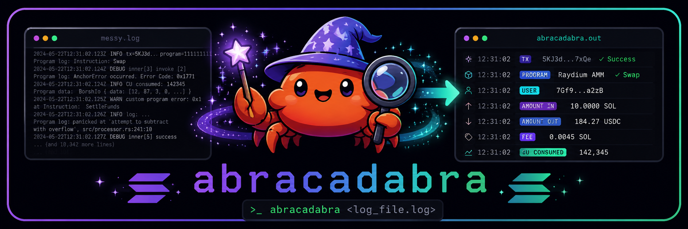
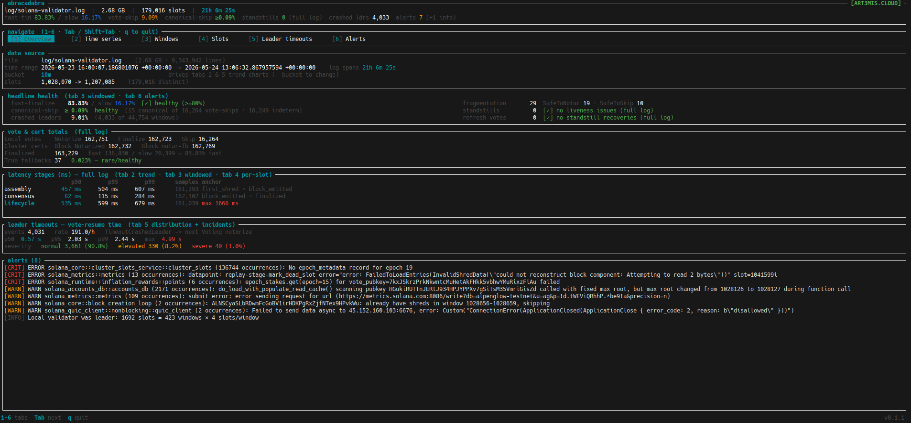
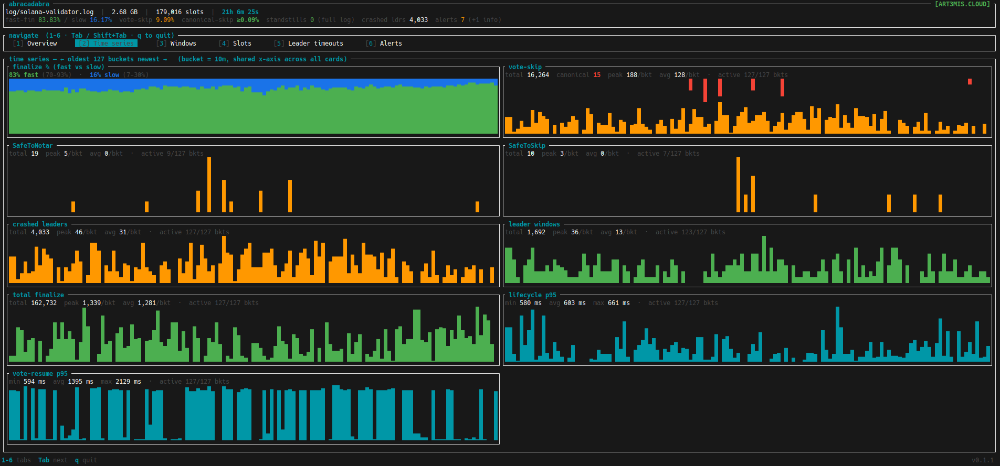
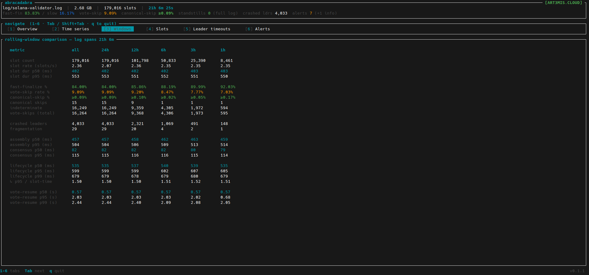
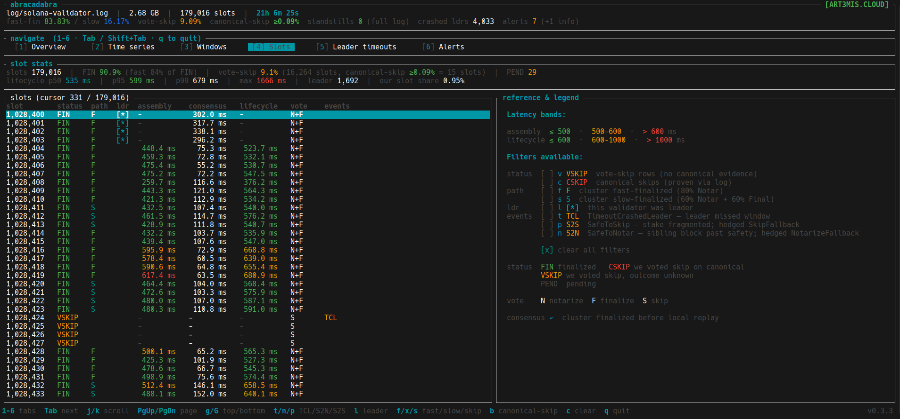
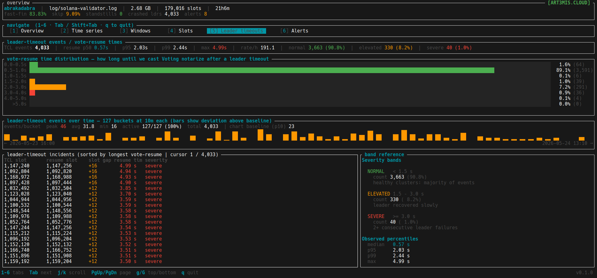
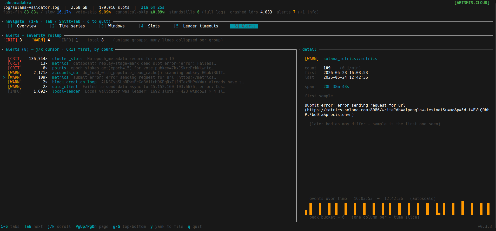

<div align="center">



**Solana Alpenglow validator log analyzer — terminal UI**

[](https://github.com/a3mc/abracadabra/actions/workflows/ci.yml)
[](#license)
[](https://www.rust-lang.org)

</div>

---

## Build

```sh
cargo build --release
./target/release/abracadabra path/to/validator.log
```

Or grab a prebuilt binary from [Releases](https://github.com/a3mc/abracadabra/releases) — Linux `gnu` (glibc ≥ 2.35) or fully-static `musl`.

## Tour

### Overview



### Time series



### Windows



### Slots



### Leader timeouts



### Alerts



## Keys

| | |
|---|---|
| `1`–`6` / `Tab` | Switch tabs |
| `j` / `k` · `PgUp` / `PgDn` · `g` / `G` | Scroll |
| `t` `n` `p` | Slots filter — TCL / S2N / S2S |
| `l` `f` `x` `s` | Slots filter — leader / fast / slow / skipped |
| `c` | Slots — clear filters |
| `y` | Alerts — yank to `/tmp/abracadabra-yank-N.txt` |
| `q` / `Esc` | Quit |

## Flags

```
--bucket <DUR>   Time-series bucket size  (default 10m, range 1m..=24h)
--text           Non-interactive summary instead of the TUI
--version        Print version
--help           Print full help
```

## License

Dual-licensed under either [MIT](LICENSE-MIT) or [Apache-2.0](LICENSE-APACHE) at your option.

Built by [ART3MIS.CLOUD](https://art3mis.cloud).
